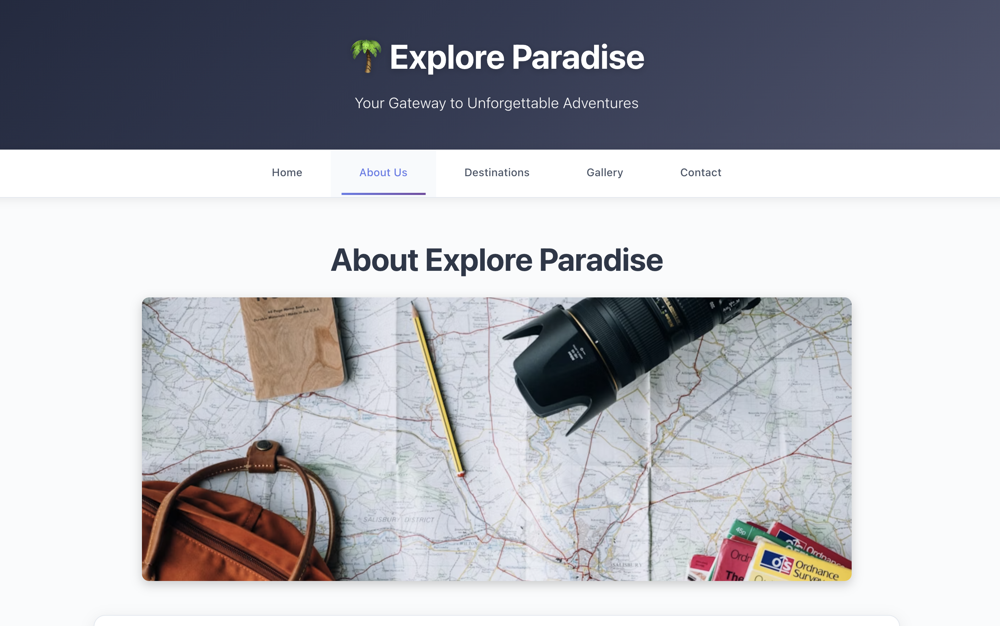
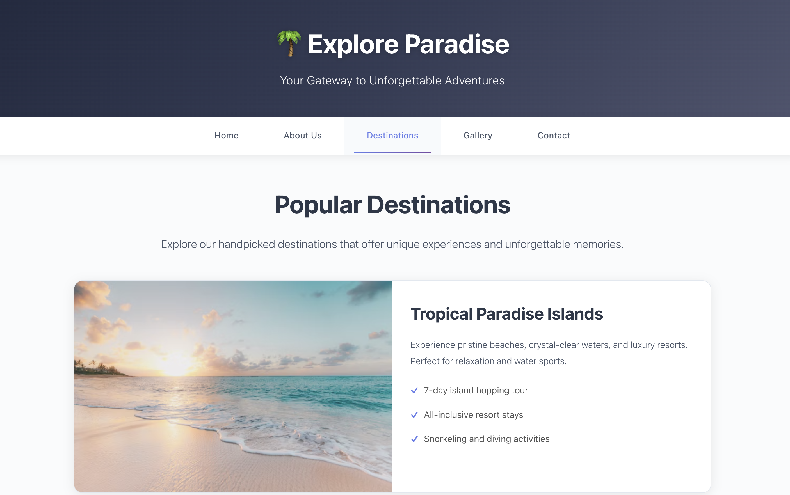
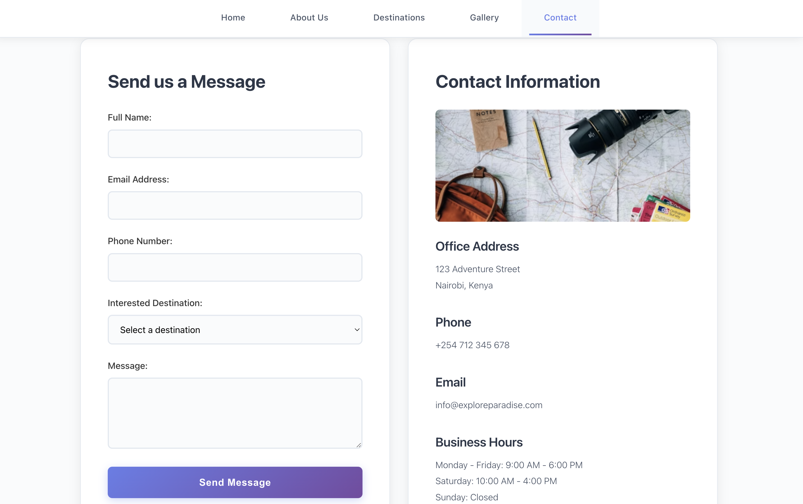

# Explore Paradise - Website Screenshots

This document contains screenshots of all the web pages from the Explore Paradise website.

## Website Screenshots

### Screenshot 1

---

### Screenshot 2

---

### Screenshot 3

---

### Screenshot 4

---

### Screenshot 5

---

### Screenshot 6

---

## Website Structure

The Explore Paradise website consists of the following pages:

1. **Home Page (index.html)** - Main landing page with hero section, features, video, and audio sections
2. **About Us (about.html)** - Information about the company, mission, and core values
3. **Destinations (destinations.html)** - Showcase of popular travel destinations
4. **Gallery (gallery.html)** - Photo gallery of travel experiences
5. **Contact (contact.html)** - Contact form and contact information

## Features

- Responsive design that works on all devices
- Beautiful UI with modern styling
- Video and audio integration
- Contact form for inquiries
- Image gallery showcasing destinations

## Technologies Used

- HTML5
- CSS3
- Responsive Web Design
- YouTube Video Integration
- Audio Elements
