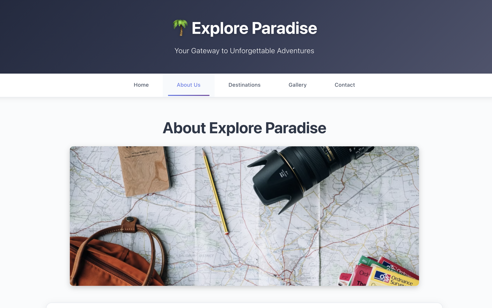
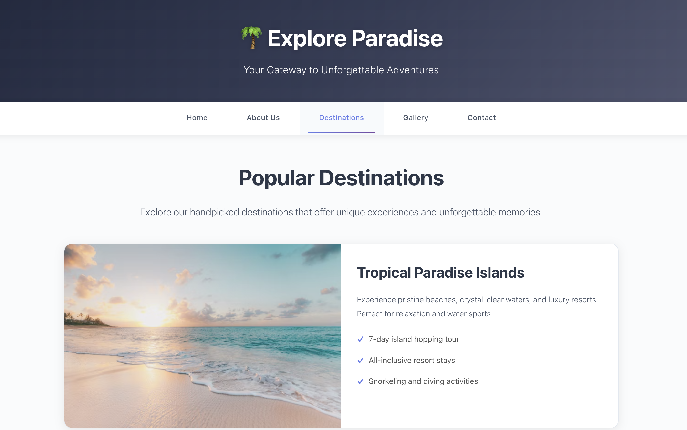
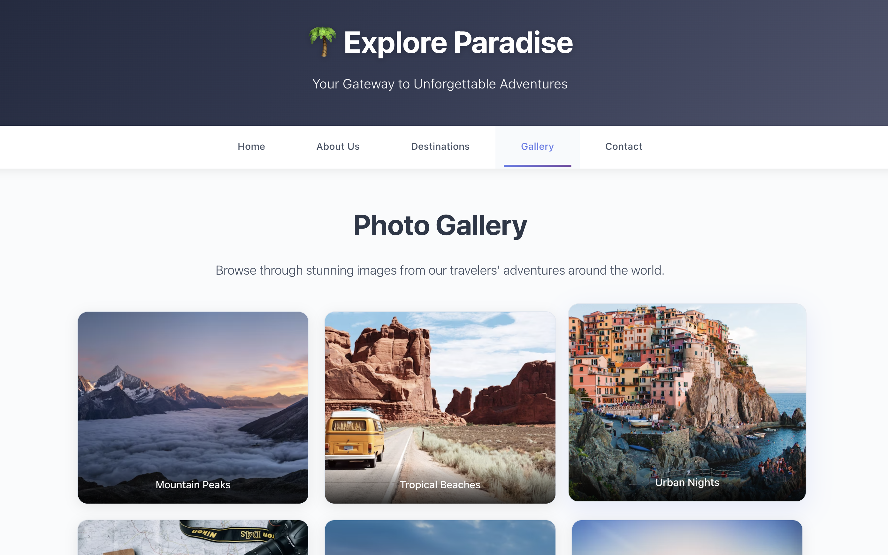
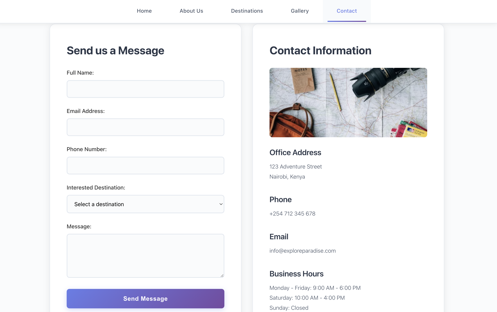

# Explore Paradise - Website Screenshots

This document contains screenshots of all the web pages from the Explore Paradise website.

## Website Screenshots

### Home Page


---

### About Page


---

### Destinations Page


---

### Gallery Page


---

### Contact Page


---

### Video Section


---

## Website Structure

The Explore Paradise website consists of the following pages:

1. **Home Page (index.html)** - Main landing page with hero section, features, video, and audio sections
2. **About Us (about.html)** - Information about the company, mission, and core values
3. **Destinations (destinations.html)** - Showcase of popular travel destinations
4. **Gallery (gallery.html)** - Photo gallery of travel experiences
5. **Contact (contact.html)** - Contact form and contact information

## Features

- Responsive design that works on all devices
- Beautiful UI with modern styling
- Video and audio integration
- Contact form for inquiries
- Image gallery showcasing destinations

## Technologies Used

- HTML5
- CSS3
- Responsive Web Design
- YouTube Video Integration
- Audio Elements

---

## Deployment to GitHub Pages

This website is configured to deploy automatically to GitHub Pages using GitHub Actions.

**Repository**: [https://github.com/winnie-mutembei/intranet-p-task](https://github.com/winnie-mutembei/intranet-p-task)

### Setup Instructions

1. **Make sure all files are committed and pushed**
   ```bash
   git add .
   git commit -m "Add GitHub Actions workflow for deployment"
   git push origin master
   ```

2. **Enable GitHub Pages with GitHub Actions**
   - Go to your repository: [https://github.com/winnie-mutembei/intranet-p-task](https://github.com/winnie-mutembei/intranet-p-task)
   - Click on **Settings** (top right of repository page)
   - Scroll down and click on **Pages** in the left sidebar
   - Under **Source**, select **GitHub Actions** (NOT "Deploy from a branch")
   - Save the changes

3. **Trigger the first deployment**
   - Go to the **Actions** tab in your repository
   - You should see the "Deploy to GitHub Pages" workflow
   - Click on it and then click **Run workflow** button
   - Select the `master` branch and click **Run workflow**

4. **Access your website**
   - After deployment completes (usually 1-2 minutes), your website will be available at:
   - **Live Site**: `https://winnie-mutembei.github.io/intranet-p-task/`

### Automatic Deployment

- Once set up, every push to the `master` branch will automatically trigger deployment
- You can monitor deployments in the **Actions** tab
- Each successful deployment will update your live site

### Manual Deployment

You can also manually trigger deployments:
- Go to the **Actions** tab → **Deploy to GitHub Pages** workflow
- Click **Run workflow** → Select `master` branch → **Run workflow**

### Troubleshooting

- If the workflow doesn't appear in Actions, make sure you've pushed the `.github/workflows/deploy.yml` file
- If Pages shows an error, ensure you selected **GitHub Actions** (not "Deploy from a branch") in Settings → Pages
- Check the Actions tab for any error messages in the workflow logs

### Notes

- The deployment workflow is configured to run on push to `master` branch
- Your repository uses the `master` branch (workflow supports both `main` and `master`)
- Deployment typically takes 1-2 minutes to complete
- Your live site URL: `https://winnie-mutembei.github.io/intranet-p-task/`
